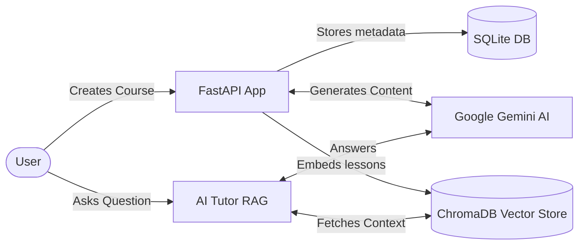

# TutorU

[](https://opensource.org/licenses/MIT)
[](https://www.python.org/downloads/)
[](https://fastapi.tiangolo.com/)
[](https://aistudio.google.com/)
[](https://tutoru-1v05.onrender.com/)

An AI-powered web application that generates personalized courses, schedules, and quizzes on any topic using Google Gemini.

**Live Demo**: [https://tutoru-1v05.onrender.com/](https://tutoru-1v05.onrender.com/)

---

## Table of Contents
1. [Project Description](#project-description)
2. [Features](#features)
3. [Architecture](#architecture)
4. [How to Install and Run the Project](#how-to-install-and-run-the-project)
5. [How to Use the Project](#how-to-use-the-project)
6. [How to Contribute to the Project](#how-to-contribute-to-the-project)
7. [Credits](#credits)
8. [License](#license)

---

## Project Description

TutorU allows you to type in a topic and instantly receive a fully structured curriculum. It solves the problem of not knowing where to start when learning a new skill. It creates chapters, writes comprehensive markdown lessons, and generates adaptive quizzes to test your knowledge. 

The app also features a Retrieval-Augmented Generation (RAG) AI Tutor that can answer questions based strictly on the generated lesson material without hallucinating outside facts. 

## Features

- **AI Course Generation**: Auto-generates chapters, lessons, and quizzes based on a single topic prompt.
- **Smart Scheduling**: Plans out your lessons and quizzes daily.
- **Context-Aware AI Tutor**: Ask questions about specific lessons using the built-in RAG chatbot.
- **Adaptive Quizzes**: Auto-generates multiple-choice quizzes with instant grading and feedback.
- **Modern Minimal UI**: Clean, professional design built with a custom CSS framework on top of Bootstrap.

## Architecture

TutorU is a monolith built on FastAPI, using SQLite for persistence and ChromaDB for local vector storage.



## How to Install and Run the Project

### Prerequisites
- Python 3.10+
- Google Gemini API Key
- Git

### Installation Steps

1. **Clone the repository**:
```bash
git clone https://github.com/AnandkumarMall/TutorU.git
cd TutorU
```

2. **Create a virtual environment and install dependencies**:
```bash
python -m venv .venv
source .venv/bin/activate  # On Windows: .venv\Scripts\activate
pip install -r requirements.txt
```

3. **Configure environment variables**:
Create a `.env` file in the project root:
```env
GOOGLE_API_KEY=your_gemini_api_key_here
SECRET_KEY=your_secure_random_string_here
```

4. **Run the application**:
Start the FastAPI server using Uvicorn:
```bash
uvicorn main:app --reload
```
The app will be available at `http://127.0.0.1:8000`.

## How to Use the Project

1. Open the application in your browser.
2. Click **Create New Course** and enter a topic (e.g., "Introduction to Python").
3. Wait for the AI to generate the chapters, select the ones you want, and proceed.
4. Navigate to your **Dashboard** to see your daily scheduled tasks.
5. Click on a lesson to read it, or use the **AI Tutor** sidebar to ask questions about the text.
6. Take the generated quizzes to track your progress!

## How to Contribute to the Project

We welcome contributions! If you would like to help improve TutorU:

1. Fork the repository.
2. Create a new branch for your feature (`git checkout -b feature/amazing-feature`).
3. Commit your changes (`git commit -m 'Add some amazing feature'`).
4. Push to the branch (`git push origin feature/amazing-feature`).
5. Open a Pull Request.

Please ensure your code follows standard PEP 8 guidelines and doesn't break any existing routes. 

## Credits

Built and maintained by **Anand Kumar Mall**. 
- GitHub: [@AnandkumarMall](https://github.com/AnandkumarMall)
- Powered by [FastAPI](https://fastapi.tiangolo.com/), [LangChain](https://www.langchain.com/), and [Google Gemini](https://deepmind.google/technologies/gemini/).

## License

This project is licensed under the [MIT License](https://opensource.org/licenses/MIT). You are free to modify and use it for commercial purposes.
