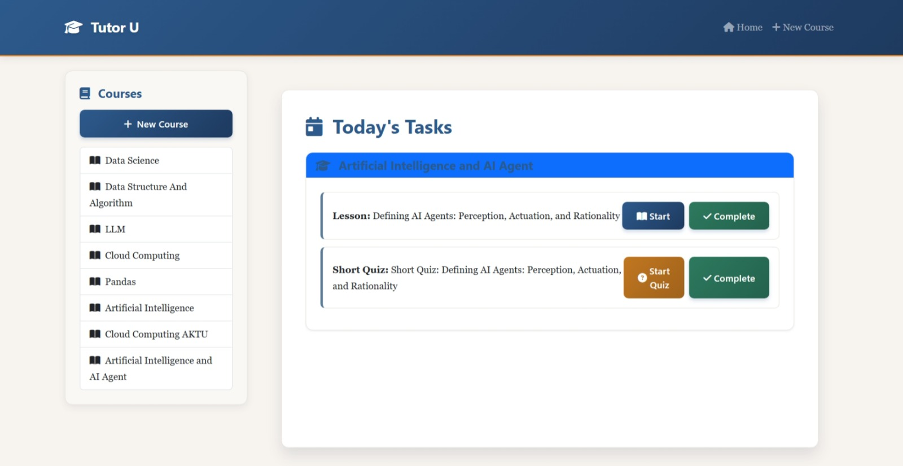
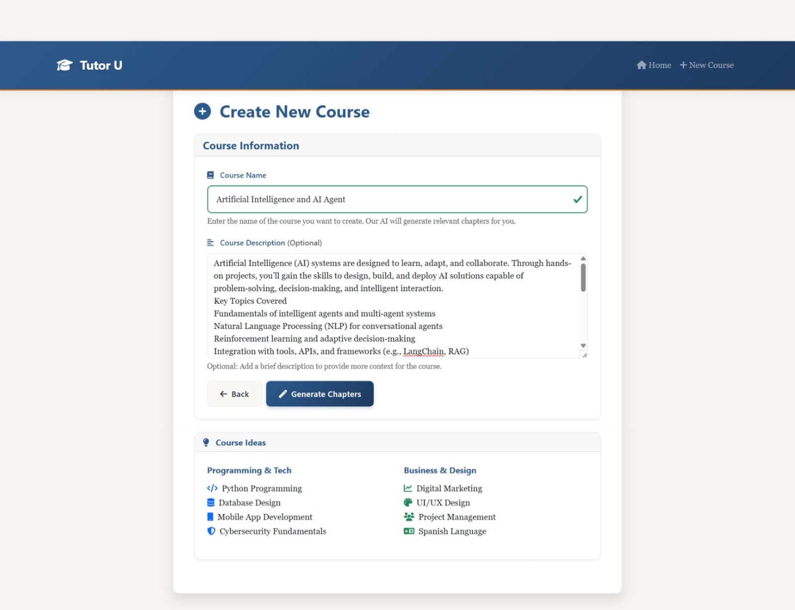
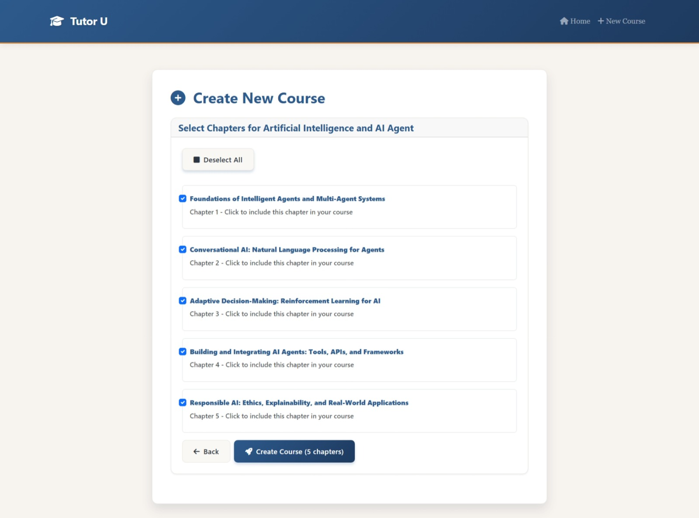
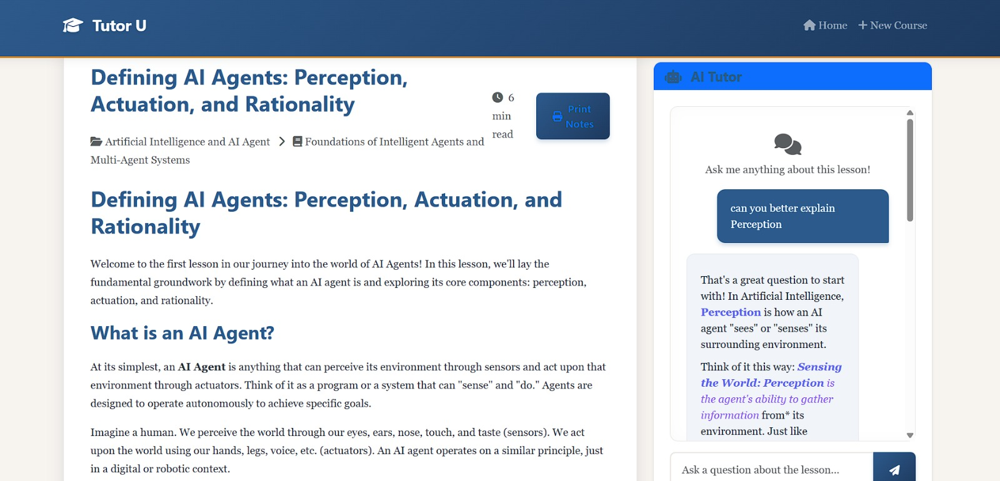
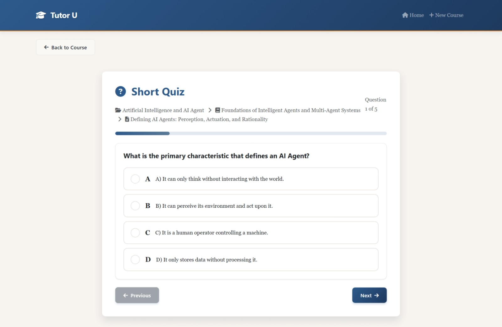
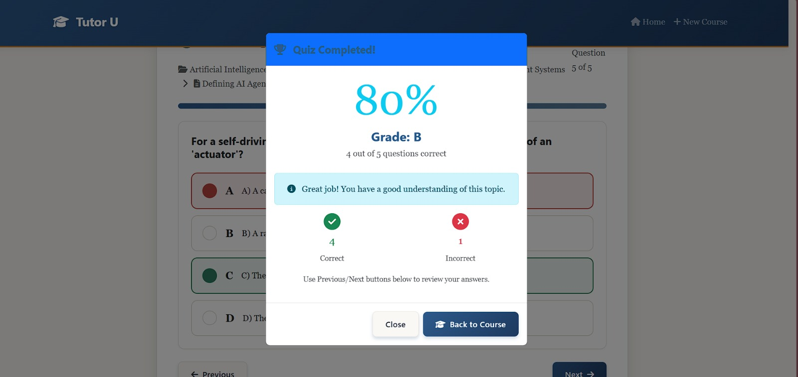

# TutorU


**TutorU** is a beautiful, AI-powered web application that helps you create, schedule, and complete personalized online courses in minutes. Powered by **Google Gemini** and **LangChain**, it generates complete courses with chapters, lessons, and quizzes tailored to any topic you want to learn.



## ✨ Features

- **AI Course Generation** – Just type a topic and get a full structured course instantly
- **Smart Daily Scheduling** – Automatic lesson + quiz planner
- **Interactive AI Tutor** – Ask questions about any lesson (RAG-powered, no hallucination)
- **Adaptive Quizzes** – Auto-generated MCQs with instant scoring and feedback
- **Progress Tracking** – Mark tasks complete and track your learning journey
- **Modern & Responsive UI** – Clean, warm, professional design with Bootstrap 5

### Screenshots

**1. Create New Course**


**2. Select Chapters**


**3. Generated Course & Notes**


**4. Today's Tasks / Dashboard**


**5. Quiz Interface**


**6. Quiz Result & Feedback**


## 🛠️ Tech Stack

- **Backend**: Flask + Flask-SQLAlchemy
- **AI**: Google Gemini (via LangChain) + Sentence Transformers + FAISS (RAG)
- **Frontend**: Bootstrap 5 + Custom warm theme
- **Database**: SQLite (easily scalable to PostgreSQL)
## 🚀 Quick Start

### Prerequisites
- Python 3.8+
- Google Gemini API Key ([Get it here](https://aistudio.google.com/))

### Installation

```bash
git clone https://github.com/AnandkumarMall/tutoru.git
cd tutoru

# Create virtual environment
python -m venv venv
source venv/bin/activate    # Windows: venv\Scripts\activate

# Install dependencies
pip install -r requirements.txt

# Setup environment variables
cp .env.example .env
# Add your GOOGLE_API_KEY and SECRET_KEY in .env
```

### Run the Application

```bash
python app.py
```

Open your browser and go to `http://127.0.0.1:5000`

---

## 📖 How to Use

1. Go to **"Create New Course"**
2. Enter any topic (e.g., "Python for Data Science")
3. AI generates chapters → Select desired chapters
4. Course with lessons, schedule, and quizzes is created automatically
5. Start learning from the Dashboard

## 🏗️ Project Structure

```
tutoru/
├── app.py                 # Main Flask application
├── models.py              # Database models
├── utils.py               # AI chains and RAG logic
├── templates/             # Jinja2 HTML templates
├── static/                # CSS, JS, and screenshots
├── courses.db             # SQLite database
└── .env                   # API keys
```

## 🤝 Contributing

Contributions are welcome! Feel free to:

- Improve the UI/UX
- Add new AI features
- Enhance RAG accuracy
- Add user authentication
- Write tests

### Steps to Contribute

1. Fork the repository
2. Create a feature branch (`git checkout -b feature/amazing-idea`)
3. Commit your changes
4. Push to the branch
5. Open a Pull Request

---

**Built with ❤️ by [Anand Kumar Mall](https://github.com/AnandkumarMall)**
